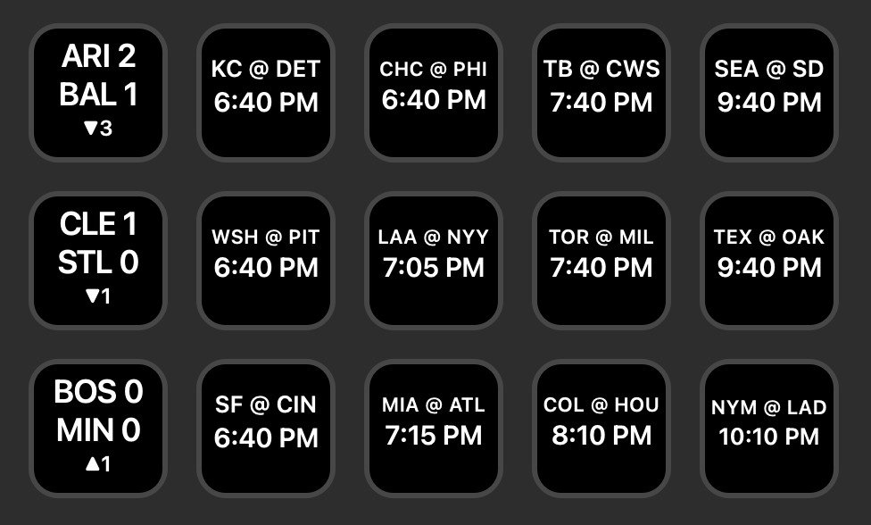
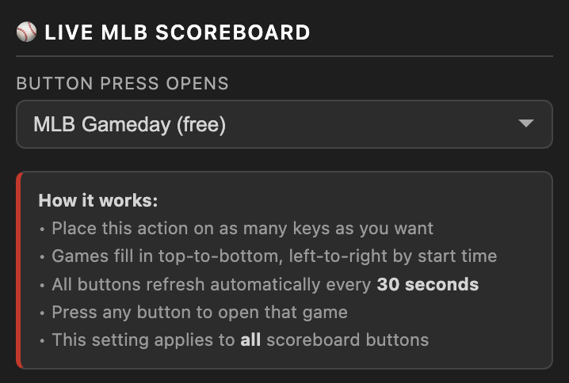

# Live MLB Scoreboard — Stream Deck Plugin



A Stream Deck plugin that displays today's full MLB schedule across multiple buttons — one game per key, updating live every 30 seconds. Designed for the Stream Deck XL or any setup with 15 or more keys.

 

---

## Features

- **Full day at a glance** — every game on today's schedule gets its own button
- **Live scores** — shows away score, home score, and current inning while a game is in progress
- **Pre-game** — shows the matchup (e.g. `NYM @ LAD`) and scheduled start time
- **Final scores** — shows the final score with a "Final" label
- **Score-change flash** — when a team scores, that game's button flashes in the scoring team's primary color
- **Special states** — postponed games show `PPD`, suspended games show `SUSP`, rain delays show `DELAY`
- **Doubleheader support** — both games each get their own button with G1/G2 labels so you always know which game is which
- **Browser shortcut** — press any button to open that game in MLB Gameday or MLB.tv
- **Overflow indicator** — if there are more games than buttons, the last button shows how many are off-screen and opens MLB Scores on press
- **No-flicker updates** — buttons only redraw when the display actually changes
- **Shared settings** — fill order, link type, and finals placement apply to all buttons at once
- **Completed games to the end** — optionally push finished games to the back of the list so live and upcoming games stay up front

---

## Requirements

- [Elgato Stream Deck](https://www.elgato.com/stream-deck) hardware (XL or Virtual Stream Deck recommended) or the [Stream Deck Mobile](https://www.elgato.com/stream-deck-mobile) app
- [Stream Deck software](https://www.elgato.com/downloads) version 6.0 or later (Mac or Windows)
- No MLB account required for scores — the plugin uses MLB's free public stats API

---

## Installation

1. Download the latest **`Live MLB Scoreboard.streamDeckPlugin`** from the [Releases](../../releases) page
2. Double-click the file — Stream Deck will install it automatically
3. The plugin will appear in the Stream Deck action picker under **Live MLB Scoreboard**

---

## Setup

1. Drag the **Live MLB Scoreboard** action onto as many buttons as you want
2. In the settings panel, choose your fill order:
   - **Top-to-bottom, left-to-right** (default) — fills each column before moving to the next
   - **Left-to-right, top-to-bottom** — fills each row before moving to the next
3. In the settings panel, choose what happens when you press a button:
   - **MLB Gameday (free)** — opens the game's live Gameday page in your browser
   - **MLB.tv (subscription)** — opens the game's MLB.tv broadcast page



That's it. All buttons will populate within a few seconds and refresh automatically every 30 seconds.

> **Note:** If MLB.tv is selected but the game hasn't started yet (and is more than 60 minutes away), pressing the button will open Gameday instead.

---

## How Many Keys Do I Need?

A full regular season day has up to **15 games**. The Stream Deck XL (32 keys) gives you plenty of room. A virtual Stream Deck works great too.

During **Spring Training**, Split Squad days can push the total above 15 — consider adding extra keys to make sure you catch every game.

---

## Recent Updates

**v1.0.15.0**
- New setting: send completed games to the end of the list, so finished games don't clutter the front of the board while others are still live

**v1.0.14.0**
- Fixed: the inning/out indicator row now stays centered when a G1 or G2 label is shown during doubleheaders

**v1.0.13.0**
- Pre-game delays now show the updated start time alongside the DELAY indicator — if the first pitch gets pushed back, the button reflects the new time within 30 seconds

**v1.0.12.0**
- Fixed: All-Star Game now shows AL @ NL instead of MLB @ MLB

**v1.0.11.0**
- Doubleheader labels: when two teams play twice in a day, each game's button now shows G1 or G2 — in the inning indicator during live play, next to "Final" when the game ends, and as a third line before the game starts

**v1.0.10.0**
- Fixed: buttons no longer switch to "Top 1" during pre-game warmups before first pitch — the matchup and start time stay visible until the game actually begins

**v1.0.9.0**
- Out indicators: two dots appear to the left of the inning — gray for unrecorded outs, red for recorded outs (inspired by classic out-of-town scoreboards)

**v1.0.6.0**
- Added overflow indicator: when there are more games than buttons, the last button shows how many games aren't displayed and opens MLB Scores on press

**v1.0.5.0**
- Added fill order setting: choose between top-to-bottom, left-to-right (default) or left-to-right, top-to-bottom

**v1.0.4.0**
- Updated Oakland Athletics to Athletics (ATH) to reflect team's relocation to Sacramento

**v1.0.3.0**
- Updated action and category icons to white on transparent background
- Added plugin category for Stream Deck action picker grouping

**v1.0.2.0**
- PPD and SUSP now display in red — signals the game won't happen today
- Pre-game rain delay displays DELAY in blue
- Mid-game rain delay keeps the current score visible with DELAY in blue where the inning indicator normally sits

*Note: v1.0.1 was an internal build — all changes are included here.*

**v1.0.1**
- Inning indicator and "Final" label now display in yellow
- End-of-game fireworks animation with the winning team's name and colors

---

## What the Buttons Show

**Before the game:**
```
NYM @ LAD
10:10 PM
```

**Live game:**
```
NYM  2
LAD  1
 ▲7
```

**Final score:**
```
NYM  2
LAD  1
Final
```

**Postponed / Suspended / Delayed:**
```
NYM @ LAD
   PPD
```
```
NYM @ LAD
  DELAY
```

---

## How It Works

The plugin polls [MLB's free public Stats API](https://statsapi.mlb.com) once every 30 seconds — a single shared request for all buttons at once. Games are sorted by start time and distributed to buttons in column-major order (top-to-bottom, left-to-right). No API key or account is required. The plugin is fully self-contained and uses only Node.js built-in modules.

The schedule holds on the current day's games until 2 AM local time, so late-running games stay on the board until they finish.

---

## Uninstalling

Open Stream Deck → Preferences → Plugins, select **Live MLB Scoreboard**, and click the **−** button.

---

## Contributing

Bug reports and feature requests are welcome — open an [Issue](../../issues) to get started.

---

## Disclaimer

This plugin is not affiliated with, endorsed by, or sponsored by Major League Baseball or MLB Advanced Media, L.P. All data is sourced from the MLB Stats API and is subject to MLBAM's terms of use. This plugin is intended for individual, personal, non-commercial use only.

---

## Credits

Created by **T.J. Lauerman aka ThatSportsGamer**

Created with Claude Cowork by Anthropic

Data provided by the [MLB Stats API](https://statsapi.mlb.com)
